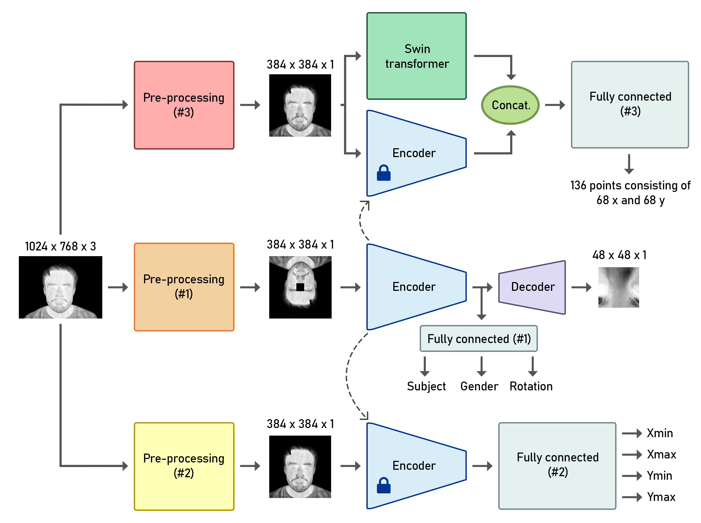
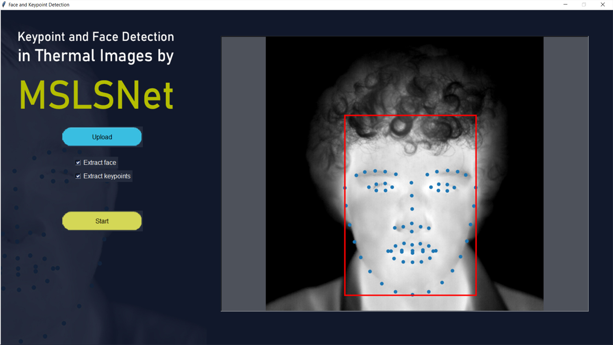
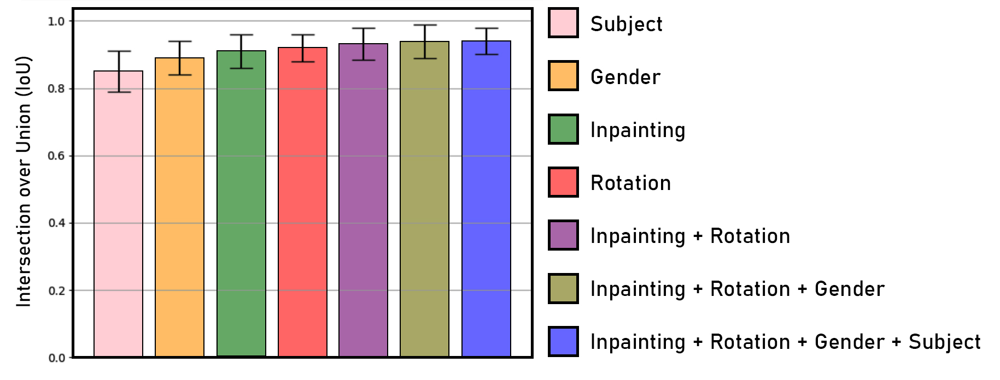
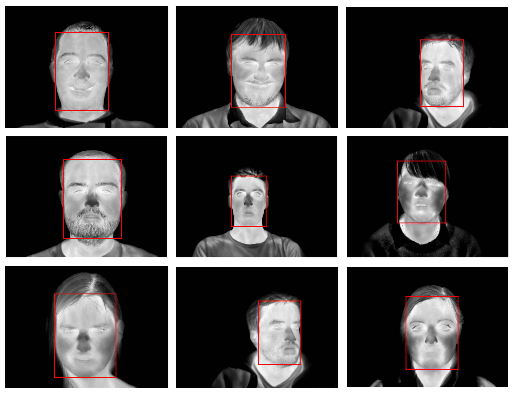
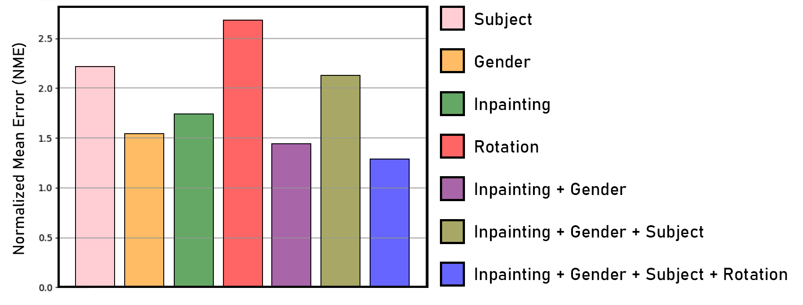
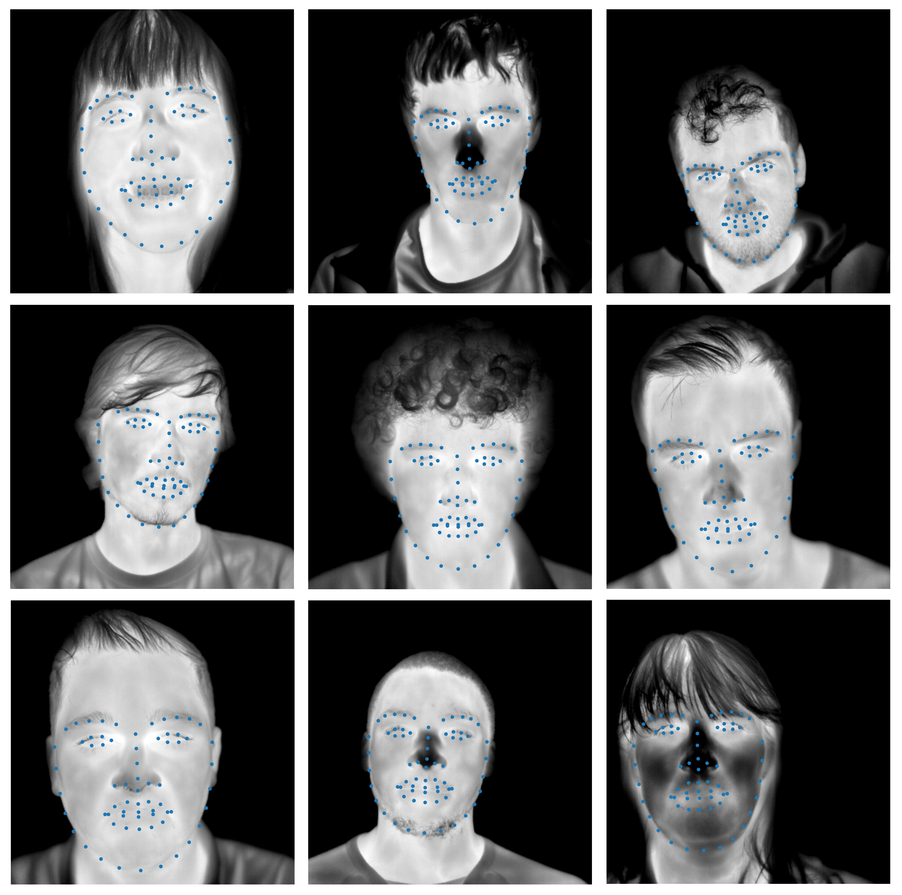

# SSL-and-swin-Keypoint-Detection-in-Thermal-Images

MSLSNet: A Combination Of Multi-task Self-supervised Learning And Swin Transformer Network For Face and Keypoint Detection In Thermal Images 



## Table of Contents

1. [Folder Structure](#folder-structure)
2. [Project Description](#project-description)
3. [Graphical User Interface (GUI)](#graphical-user-interface)
4. [Results](#results)
5. [Usage](#usage)
6. [License](#license)


## Folder Structure

- **Src folder:**
  - `01 Pretext`
  - `02 Face detection`
  - `03 Keypoint detection`
  - `04 Comparison`
  - `05 Supervised`

- **GUI:**
  - Contains the designed GUI for using face and keypoint detection models.

- **Evaluation:**
  - Contains evaluation and output creation for the model.


### Project Description

This repository presents a groundbreaking study introducing a novel multi-task self-supervised learning approach for precise face and facial keypoint detection in thermal images. The primary motivation behind this research is to leverage thermal images for vital sign extraction and psychological condition detection, addressing the challenge of limited annotated thermal image datasets.

* Self-Supervised Learning Approach: Our approach tackles the scarcity of labeled data by employing self-supervised learning, eliminating the need for explicit labels or a large labeled dataset. The model is trained through four distinct pretext tasks: gender detection, subject detection, rotation prediction, and image inpainting. This comprehensive learning strategy provides valuable insights that facilitate robust learning of facial features, ensuring adaptability across various faces and scenarios in real-world applications.

* Model Fine-Tuning and Enhancement: The pre-trained model on pretext tasks is fine-tuned for face detection and keypoint localization. We incorporate the Swin Transformer for keypoint detection, enhancing spatial relationships between facial parts and resulting in improved system performance.

* Strong Performance Across Pretext Tasks: Our results demonstrate strong performance across pretext tasks. Notably, the model achieves a 98.96% accuracy in gender detection, 67.01% accuracy in subject detection, and 99.31% accuracy in rotation prediction. The model's ability to inpaint images yields a high Peak Signal-to-Noise Ratio (PSNR) of 21.9, signifying accurate reconstruction of inpainted regions compared to the original images.

* Face Detection Precision: Our method excels in face detection, surpassing other algorithms with a detection rate exceeding 80% at a 0.9 Intersection over Union (IoU). The model's precision in generating bounding boxes around detected faces, especially in capturing the upper boundary defining the hair growth line, sets it apart from existing approaches.

* Facial Keypoint Detection Precision: In facial keypoint detection, our approach outperforms all available methods with an outstanding Normalized Mean Error (NME) score of 1.29, establishing a new standard for precision and accuracy in this field.

* Comprehensive Analysis of Pretext Task Combinations: We conduct a thorough analysis of various pretext task combinations, highlighting the impact on downstream task results. The findings indicate that an increased number of pretext tasks result in enhanced robustness and precision in both face and facial keypoint detection.

* User-Friendly Graphical User Interface (GUI): To simplify and enhance the user experience, we provide a Graphical User Interface (GUI) for both face detection and facial keypoint detection. This user-friendly interface is designed to cater to diverse users, facilitating the utilization of our method.

* Contributions and Future Implications: In conclusion, our study introduces a novel self-supervised learning approach for face and facial keypoint detection in thermal images. The method eliminates the need for explicit labels while delivering robust and precise performance. The chosen pretext tasks, based on a comprehensive evaluation, significantly improve accuracy and robustness, providing valuable insights for the future progress of facial analysis and its practical applications.


## Graphical User Interface

The `GUI` folder contains the designed graphical user interface (GUI) for interacting with the face and keypoint detection models. Images and additional documentation related to the GUI can be found in the [GUI folder](./GUI).




## Results

In this section, we showcase the performance results of our model in face and facial keypoint detection. The following visualizations and numerical summaries highlight the effectiveness of our approach.

## Pretext Task Results

| Task        | Value              |
|-------------|---------------------|
| Gender      | Accuracy = 98.96   |
| Rotation    | Accuracy = 99.31   |
| Subject     | Accuracy = 67.01   |
| Inpainting  | PSNR = 21.90        |

The table above summarizes the results of the pretext tasks during the self-supervised learning process. The model demonstrated impressive accuracy across multiple tasks, achieving 98.96% accuracy in gender detection, 99.31% accuracy in rotation prediction, and 67.01% accuracy in subject detection. Additionally, the Peak Signal-to-Noise Ratio (PSNR) for inpainted images averaged 21.90, indicating a high level of accuracy in the reconstructed regions compared to the original images.

## Face Detection Results
Our face detection model demonstrates exceptional precision and accuracy in detecting faces within thermal images. The method goes beyond conventional algorithms, particularly excelling in capturing the upper boundary that defines the hair growth line. This precision ensures that facial features are accurately localized, providing valuable insights for applications that require detailed facial analysis.



The Intersection over Union (IoU) metric is a key indicator of the model's ability to accurately delineate the detected faces. Our model achieves a high detection rate, with an IoU exceeding 80% under a threshold of 0.9. This surpasses the performance of other available algorithms, highlighting the effectiveness of our approach in accurately bounding detected faces. A higher IoU indicates a greater overlap between the predicted bounding box and the ground truth, showcasing the robustness of our face detection method.



### Keypoint Detection Results

Our facial keypoint detection model excels in precisely localizing key facial features in thermal images. The method demonstrates a high degree of accuracy in pinpointing critical landmarks, contributing to its effectiveness in applications requiring detailed facial analysis.



The Normalized Mean Error (NME) is a crucial metric showcasing the precision of our facial keypoint detection. Our approach achieves an outstanding NME score of 1.29, surpassing all available methods in this field. A lower NME indicates a more accurate localization of keypoints, emphasizing the effectiveness and precision of our method. This exceptional performance sets a new standard for accuracy in facial keypoint detection, providing reliable and detailed spatial information for downstream applications.




## Usage

Before using the GUI, ensure you have the required dependencies installed. You can install them by running the following command in your terminal or command prompt:

```bash
pip install -r requirements.txt
```

Once you've installed the dependencies, you can extract the zip file in the `GUI` folder to prepare the models.

```bash
cd SSL-and-swin-Keypoint-Detection-in-Thermal-Images/GUI
tar -xf models.rar
```

Then launch the graphical user interface (GUI) for face and keypoint detection by running the following command:

```bash
python GUI.py
```

This will initiate the GUI, providing an interactive environment for utilizing the face and facial keypoint detection models. Follow the on-screen instructions and prompts within the GUI to input images or perform real-time detection, depending on the provided functionality.


## License

If you find this codebase or the ideas presented in this project useful for your research or work, we kindly request that you cite our paper. This ensures proper attribution and acknowledgment of the effort put into this work.
